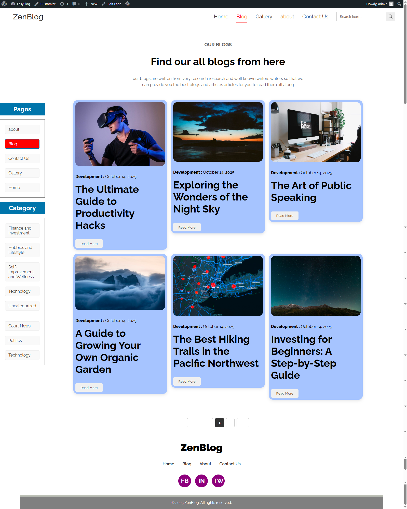
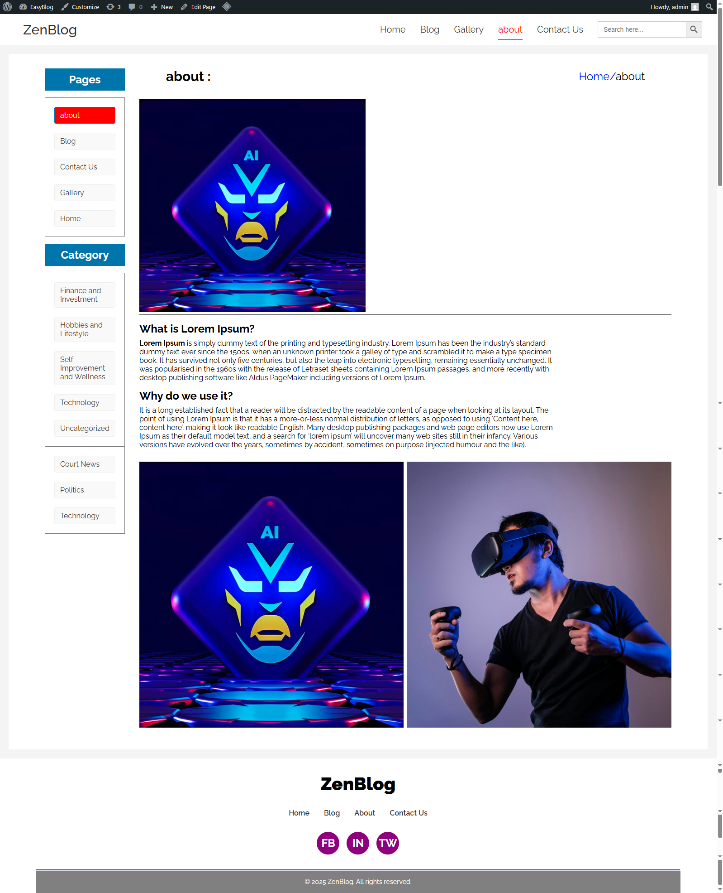
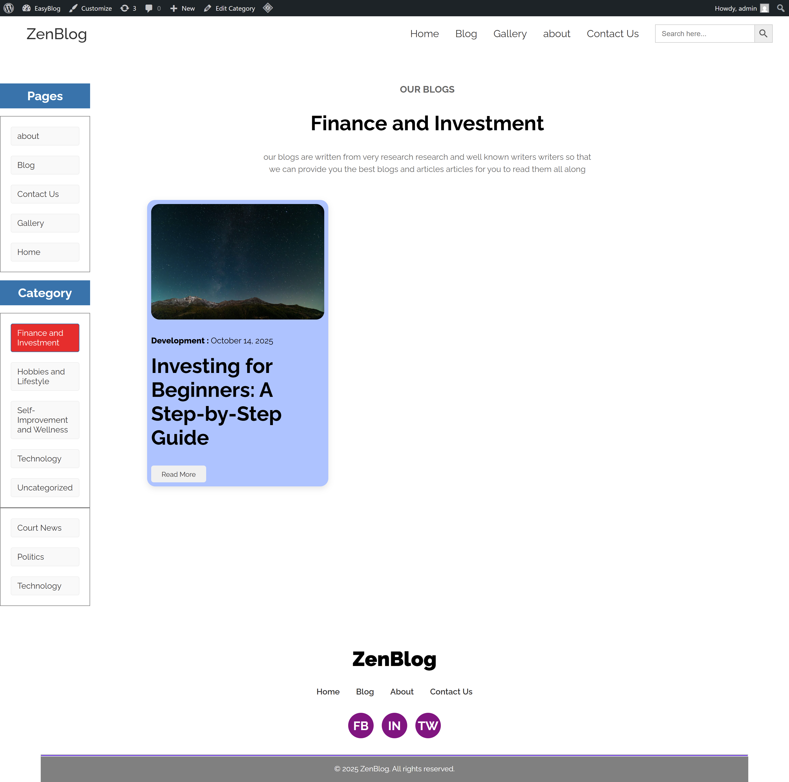
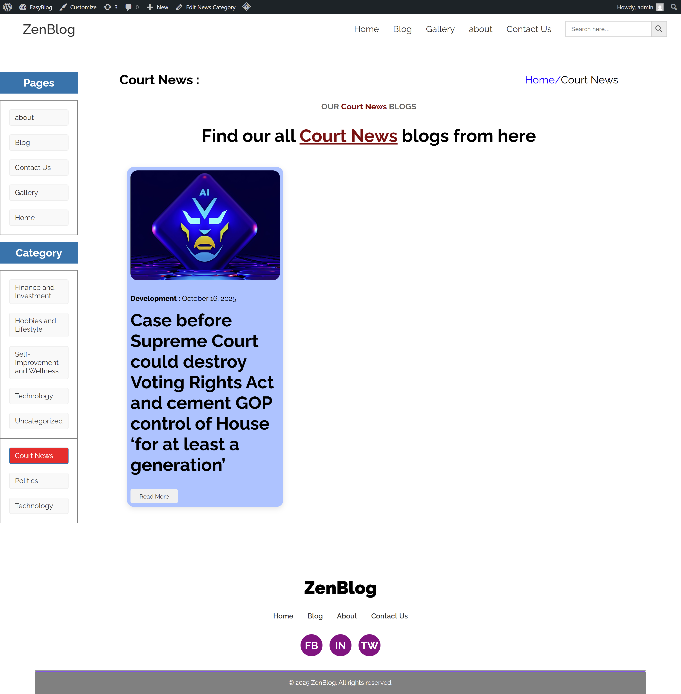
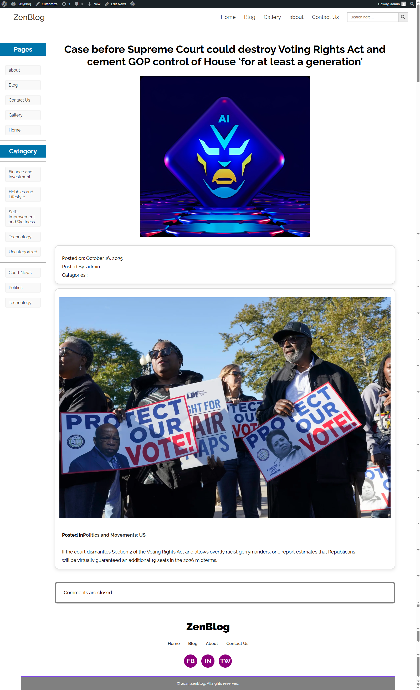
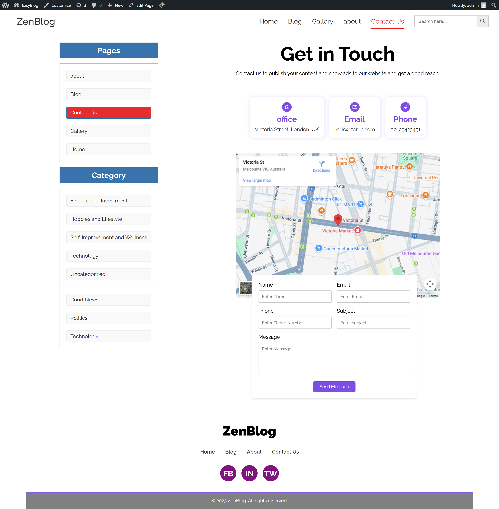

# EasyBlog – Custom WordPress Theme

## 📖 Overview

EasyBlog is a lightweight, custom-developed WordPress theme built from scratch.  
It represents a complete conversion of a static HTML template into a dynamic CMS using the **WordPress Template Hierarchy**.

The theme avoids heavy page builders and instead uses:

- Native WordPress functions  
- Custom PHP loops  
- Pure CSS for styling  

It is ideal for developers and clients who need a **fast, SEO-friendly blog + portfolio** structure.

**🔗 Live Demo:** http://easyblog.infinityfree.me

---

## 🚀 Features

- **Static to Dynamic Conversion**  
  Full port of HTML5/CSS3 templates into WordPress `.php` theme files.

- **Custom Post Types (CPT)**  
  Includes a **Projects** post type to manage portfolio items.

- **ACF Integration**  
  Supports custom fields for extended metadata (Client, Date, URL, Description).

- **Dynamic Gallery**  
  Fully dynamic gallery page via custom page template.

- **Contact Form 7 Support**  
  Integrated with custom-styled forms on the Contact page.

- **Widget Ready**  
  Dynamic sidebar + footer widget areas registered in `functions.php`.

- **Search Functionality**  
  Custom `search.php` template with clean result listings.

- **Pagination**  
  Numeric pagination for blog archives and listings.

---

## 🛠 Tech Stack

**Frontend:**  
- HTML5  
- Pure CSS (No Bootstrap/Tailwind)

**Backend:**  
- PHP  
- WordPress Core API  

**Database:**  
- MySQL  

**Required Plugins:**  
- Advanced Custom Fields (ACF)  
- Contact Form 7  

---

## ⚙️ Template Hierarchy Used

- **front-page.php** – Controls homepage layout  
- **single-project.php** – Renders single CPT entries for “Projects”  
- **page-{slug}.php** – Targeted templates (Contact, Gallery)  
- **archive.php** – Handles category, tag, and date archive loops  
- **search.php** – Search results layout  
- **single.php** – Regular blog post template  

---

## 🔧 Installation

1. Download the repository.  
2. Navigate to your WordPress installation:  
   `wp-content/themes/`  
3. Upload the **easyblog** folder.  
4. Go to **WP Admin → Appearance → Themes**.  
5. Activate **EasyBlog**.  
6. Install required plugins:
   - Advanced Custom Fields (ACF)
   - Contact Form 7  

---

## 📸 Screenshots
<table>
<tr>
<td align="center" style="padding: 10px;">

<strong> Homepage </strong>
</td>
</tr>
<tr>
<td align="center" style="padding: 10px;">

<strong> Blog </strong>
</td>
<td align="center" style="padding: 10px;">

<strong>About US</strong>
</td>
</tr>
  <tr>
    <td align="center" style="padding: 10px;">

<strong>Category</strong>
</td>
<td align="center" style="padding: 10px;">

<strong>Custom Category</strong>
</td>
  </tr>
  <tr>
    <td align="center" style="padding: 10px;">

<strong>Single-post</strong>
</td>
    <td align="center" style="padding: 10px;">

<strong>Contact</strong>
</td>
  </tr>
</table>

---

## 📝 Author

**Your Name**  
WordPress Developer  

🔗 Portfolio: *your link here*  
🔗 LinkedIn: *your link here*  

---

## 📄 License

This project is licensed under the **MIT License** – see the `LICENSE.md` file for details.

